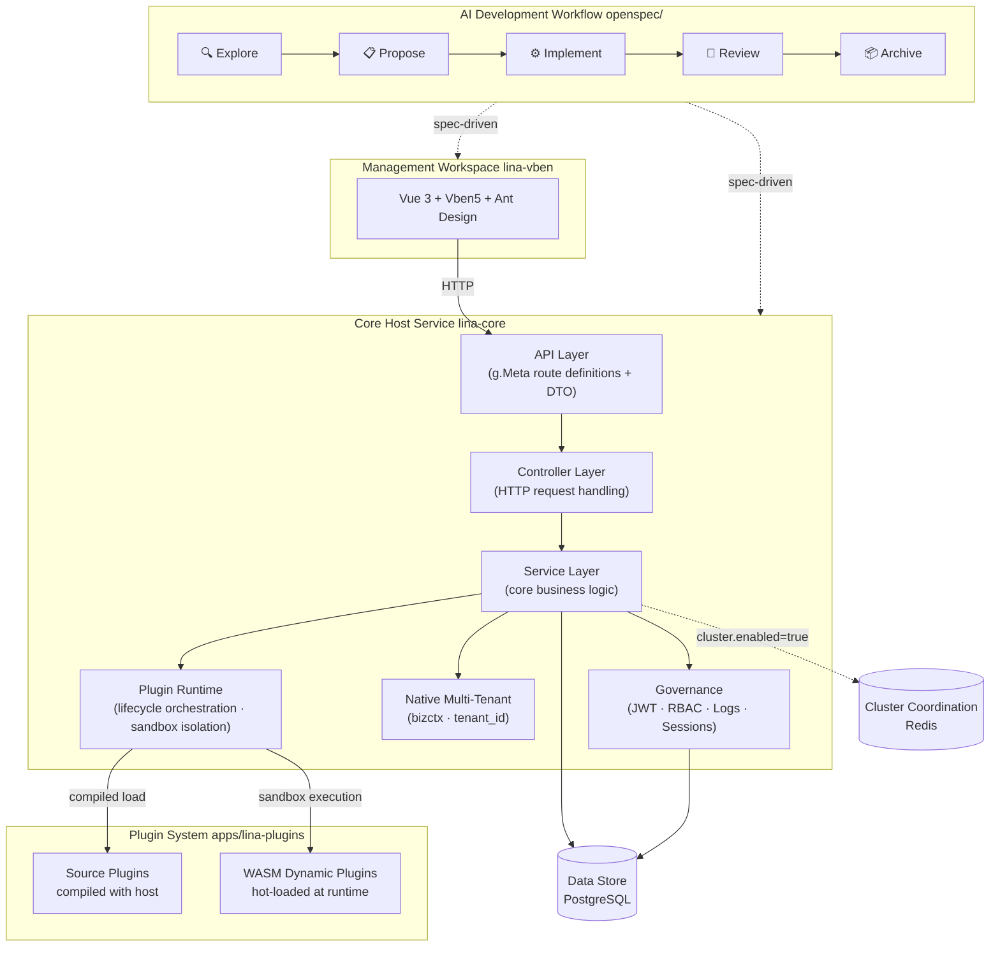

English | [简体中文](README.zh-CN.md)

# Overview

`LinaPro` is an **AI-native full-stack framework built for sustainable delivery**. It brings together a specification-driven AI development workflow, a comprehensive AI skill system spanning the entire development lifecycle, a complete plugin runtime, and an integrated full-stack design — with enterprise-grade capabilities like access control, system configuration, and job scheduling built right in.

Teams can skip the infrastructure-from-scratch phase and put AI to work driving real business development from day one.

# Quick Links

| Resource | URL |
|----------|-----|
| **Repository** | https://github.com/linaproai/linapro |
| **Live Demo** | http://demo.linapro.ai/  Username: `admin`  Password: `admin123` |
| **Website** | https://linapro.ai/ |

# Core Capabilities

`LinaPro` is designed for individual developers, engineering teams, and enterprises. Here's what it brings to the table:

- **AI-native development workflow**: Ships with a specification-driven AI development workflow, with first-class support for the optional but recommended `OpenSpec` tool. AI leads analysis, design, and implementation while every change is anchored to incremental specs and mandatory E2E tests — freeing your team to focus on direction rather than execution details.
- **A rich AI skill ecosystem**: Over a dozen built-in AI skills cover the full development lifecycle — backend development, frontend design, test writing, code review, performance auditing, version upgrades, and more. AI makes framework-aware decisions in every context without needing to be re-briefed each session.
- **Fast business development**: A batteries-included management workspace and a rich set of built-in modules dramatically shorten the path from zero to production.
- **Integrated full-stack design**: Frontend and backend are designed as a unified whole — API contracts, permission models, and design conventions are fully aligned, with no manual cross-framework integration overhead.
- **Complete API documentation**: All host and plugin API endpoints are automatically aggregated and exposed as a single browsable, debuggable doc site.
- **Extensible plugin ecosystem**: A dual-mode plugin system — source plugins and `WASM` dynamic plugins — lets any capability be extended or replaced. Official plugins are maintained as a separate submodule and pulled in only when needed, keeping the core framework lean.
- **Multi-tenant support**: Native multi-tenant capability with an official multi-tenant management plugin. When the plugin is not enabled, the system automatically falls back to single-tenant mode with zero migration cost.
- **Enterprise-grade governance**: JWT authentication paired with a declarative RBAC permission system, plus built-in operation logs, login logs, and session management for comprehensive auditability.
- **Distribution-ready by design**: Built-in distributed locking, key-value caching, and horizontal scaling. Cluster mode is coordinated via Redis for high availability — no changes to business code required.

# Architecture

# Screenshots

<table>
  <tr>
    <td></td>
    <td></td>
    <td></td>
  </tr>
  <tr>
    <td></td>
    <td></td>
    <td></td>
  </tr>
  <tr>
    <td></td>
    <td></td>
    <td></td>
  </tr>
</table>

# Tech Stack

| Category | Technology | Notes |
|----------|------------|-------|
| Backend Language | `Go` | `v1.25.0` |
| Backend Framework | `GoFrame` | `v2.10.1` — routing, ORM, configuration, and more |
| Frontend Framework | `Vue 3` | Built on the `Vben 5` admin template |
| Frontend UI | `Ant Design Vue` | Enterprise-grade UI component library |
| Build Tool | `Vite` | Lightning-fast frontend builds |
| Database | `PostgreSQL` | Default data store |
| Plugin Runtime | `WebAssembly` | `tetratelabs/wazero`, powering WASM dynamic plugins |
