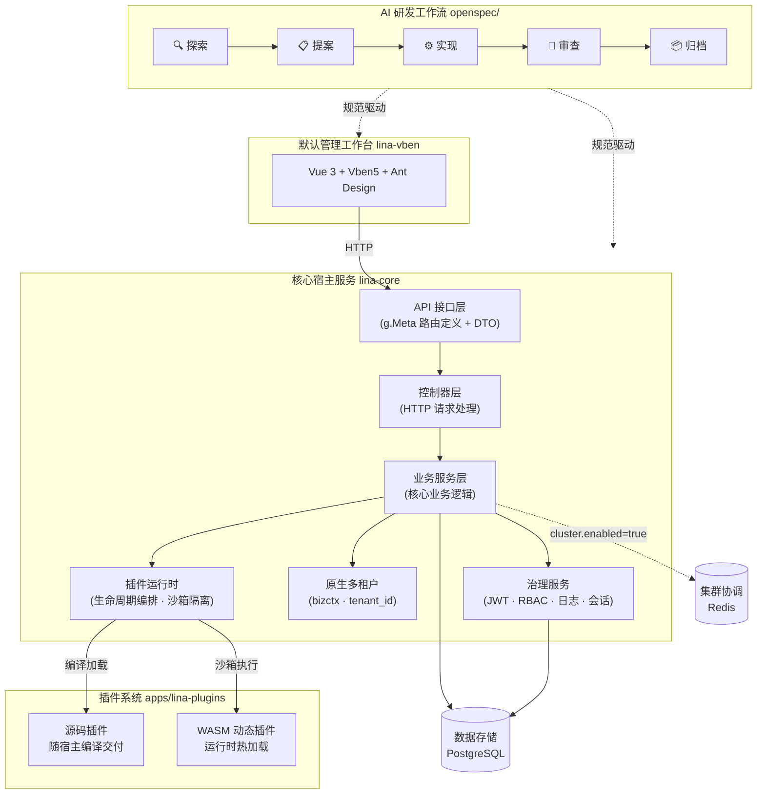

[English](README.md) | 简体中文

# 项目介绍

`LinaPro`是一款**面向可持续交付的`AI`原生全栈框架**，将规范驱动的`AI`研发工作流、全生命周期`AI`技能体系、完整插件运行时与前后端一体化全栈设计融为一体，并内置权限管理、系统配置、任务调度等企业级基础能力，为团队构建起一套完整的`AI`原生交付底座。

团队无需从零搭建基础设施，从第一天起就能以`AI`作为主力驱动业务开发和持续交付。

# 快速链接

| 资源 | 地址 |
|------|------|
| **开源仓库** | https://github.com/linaproai/linapro |
| **后台演示** | http://demo.linapro.ai/  账号：`admin`  密码：`admin123`|
| **官方网站** | https://linapro.ai/ |

# 默认入口

内置管理工作台默认从`/admin`提供访问，因此根路径`/`默认会留给源码插件或宿主部署自行维护的公开路由使用。若部署方为管理后台配置独立域名，可以将`workspace.basePath`设置为`/`，让工作台占用该域名根路径。

宿主控制面接口继续使用`/api/v1`。源码插件和动态插件的插件接口统一使用`/x/{plugin-id}/api/v1`，插件在`plugin.yaml`的`public_assets`中声明的公开静态资源会通过`/x-assets/{plugin-id}/{version}/...`提供访问。

# 项目定位

`LinaPro`面向独立开发者、研发团队和企业，提供以下核心能力：

- **AI 原生研发工作流**：内置规范驱动的`AI`研发工作流，对可选但推荐的`OpenSpec`提供良好支持，让`AI`主导分析、设计与实现，每次变更均锚定在增量规范与强制`E2E`测试上，团队专注于方向决策
- **丰富的 AI 技能体系**：内置十余项覆盖研发全生命周期的专属`AI`技能，涵盖后端开发、前端设计、测试编写、代码审查、性能审计、版本升级等场景，让`AI`在每个具体工作环节都能做出符合框架约束的专业决策
- **快速业务开发**：开箱即用的管理工作台与丰富的内置模块，显著缩短项目从零到上线的时间
- **全栈一体化**：前后端统一设计，接口契约、权限模型与设计规范完全对齐，无需独立集成两套框架
- **完整 API 文档**：自动聚合宿主与所有插件接口，支持在线浏览与调试
- **插件生态**：双模式插件系统（源码插件 +`WASM`动态插件），任意能力均可通过插件扩展或替换；官方插件以`submodule`形式独立维护，按需引入，不增加主框架负担
- **多租户支持**：框架原生支持多租户能力，提供官方多租户管理插件，未启用时自动回退单租户模式，迁移零成本
- **企业级治理**：`JWT`认证配合声明式`RBAC`权限体系，内置操作日志、登录日志、会话管理等审计能力
- **原生分布式**：底层支持分布式锁、键值缓存、水平扩展，集群模式基于`Redis`协调器实现高可用，无需改造业务代码

# 技术架构

# 工作台示例

<table>
  <tr>
    <td></td>
    <td></td>
    <td></td>
  </tr>
  <tr>
    <td></td>
    <td></td>
    <td></td>
  </tr>
  <tr>
    <td></td>
    <td></td>
    <td></td>
  </tr>
</table>

# 主要技术栈

| 类别 | 技术 | 说明 |
|------|------|------|
| 后端语言 | `Go` | `v1.25.0` |
| 后端框架 | `GoFrame` | `v2.10.1`，提供路由、`ORM`、配置等全套能力 |
| 前端框架 | `Vue 3` | 基于`Vben 5`管理台模板 |
| 前端 UI | `Ant Design Vue` | 企业级 `UI` 组件库 |
| 构建工具 | `Vite` | 极速前端构建 |
| 数据库 | `PostgreSQL` | 默认数据存储 |
| 插件运行时 | `WebAssembly` | `tetratelabs/wazero`，支持`WASM`动态插件 |
