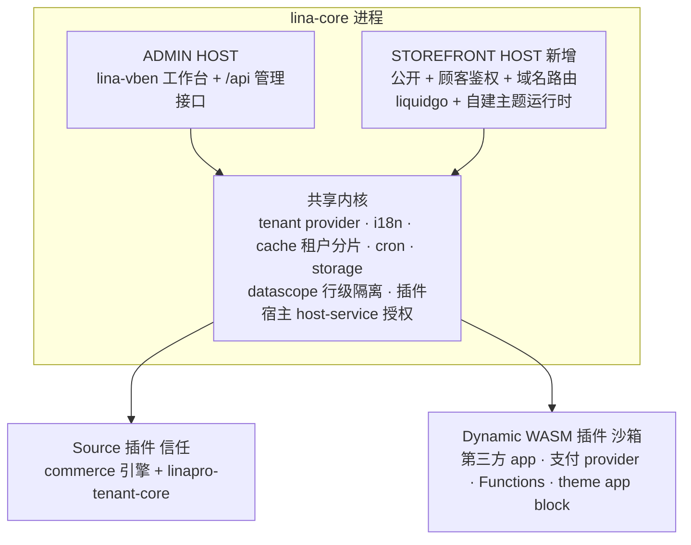
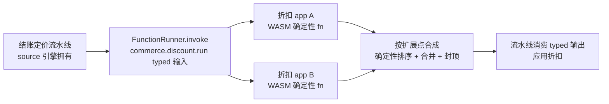

## Context

`LinaPro`是以`apps/lina-core`为核心宿主的 AI 原生全栈框架，默认呈现管理工作台。经探索核实，其现有机制具备承载商城的骨架，但缺口同样明确：

- 多租户被设计为可选 provider 能力，由源码插件`linapro-tenant-core`提供；核心内建空载降级，无 provider 时全部回落`tenant_id = 0`（平台）。该插件已随`apps/lina-plugins`submodule 检出，是完整生产级实现。
- 插件 core 现有扩展原语为 HTTP 路由、定时任务、生命周期回调、事件 Hook、Provider SPI 与 host-service；动态插件运行在`wazero`沙箱内，每次 host-call 经请求级授权快照校验。
- 缺口集中在 storefront 渲染面、主题运行时、商业域、国际化内容与货币，以及插件 core 的 typed 计算扩展（Functions）等。

环境层面已就位：`linapro`与`official-plugins`均已 fork，主仓库`origin`指向`ws4934/linapro`、`upstream`指向官方；submodule`apps/lina-plugins`指向`ws4934/official-plugins`。

## Goals / Non-Goals

**Goals：**

- 确立商城二开的北极星架构、宿主边界与模块分解，作为后续所有派生变更的约束基线。
- 确立插件 core 需新增的 6 个扩展原语方向，并把 Functions 作为承重墙优先项。
- 确立主题运行时形态（`liquidgo`SSR + 自建 Shopify 主题运行时）与`tenant-core`二开边界。
- 确立 P0–P7 分阶段路线、原语前置依赖与「每模块独立派生变更」的协作模式。

**Non-Goals：**

- 不实现任何商业功能、不编写商业域代码；落地由后续派生变更承担。
- 不在本基线详尽规范单个商业模块（catalog、checkout 等）的需求。
- 不在本基线承诺 bug-for-bug 主题兼容的完整实现细节，仅确立目标与策略。

## Decisions

### D1 `store = tenant`，复用`linapro-tenant-core`

商户即租户，复用现有租户 provider 与行级`tenant_id`隔离。备选是另建独立 store 模型；否决原因：宿主只能注册一个租户 provider，且`tenant`上下文已贯穿`datascope`、`bizctx`、`auth`、插件启停，另起一套会割裂隔离体系。

### D2 storefront 作为与 admin 平级的新 host 渲染面

storefront 是公开、域名路由、顾客鉴权、SSR、SEO 与缓存敏感的面，与 admin 工作台心智完全不同。备选是塞进`/x/<plugin-id>`插件路由（带 staff 鉴权）；否决原因：插件路由面向已登录后台，无法承载匿名顾客与按域名定店。宿主已有公开路由组先例，新增 storefront 面与现有模式一致。

### D3 SSR Liquid：`liquidgo` + 自建 Shopify 主题运行时

为兼容 Shopify 主题选择 SSR Liquid。已核实`liquidgo`提供 Ruby Liquid 5.10/5.11 全量语法、自定义 filter/tag、可按租户加载 partial 的`FileSystem`，且具备 Drop 基类与`LiquidMethodMissing`反射派发，支持懒加载与`metafields`动态字段——核心懒加载无需 fork。备选是 headless/Storefront API；否决原因：与「兼容 Shopify 主题」诉求相悖。主题运行时的对象模型、Shopify filter/tag、`OS2.0`section 架构与可视化装修需自建。

### D4 插件 core 新增 6 个扩展原语，Functions 为承重墙

现有 Hook 是 event 风格、demo 级、仅源码插件，宿主不消费其返回值改变业务结果；Provider SPI 仅源码、固定域、单实现。商城需要 typed 计算扩展点（Functions）：宿主在业务流水线调用、消费 typed 输出、支持多实现确定性合成、源码与动态 WASM 皆可实现。其余 5 个原语为 storefront 贡献面、`metafields`/`metaobjects`、events/webhooks、admin UI 扩展 slot、app 安装与计费。Functions 复用现有`ExtensionPoint`/`ExtensionKind`抽象，新增`ExtensionKindFunction`，属框架自身已留的演进位。

### D5 商业引擎用源码插件，第三方 app 用动态 WASM

商业引擎（catalog、cart、order、customer、discount）需事务、`TenantFilter()`与高性能批量装配，落为源码插件（信任）；第三方 app、支付 provider、营销物流等落为动态 WASM 插件（沙箱、host-service 授权）。这与 Shopify「app 沙箱运行、经 API 访问数据」一致。

### D6 主题打包为插件 artifact 类型，渲染引擎留宿主

主题包（模板、section、资产、locale）作为插件 core 的一种打包/分发/贡献类型，复用 catalog、安装、版本、存储与按租户启停；Liquid 渲染引擎仍是宿主`theme-engine`服务。theme app extension 则是动态插件经 storefront 贡献面注入 section/block。三者（主题、app、function）统一在插件 core 之下。

### D7 `tenant-core`二开边界

解析层改动必须落在`tenant-core`（因 provider 独占且 resolver 链在`resolver.New()`内硬编码）：让 resolver 链可被外部插件注册（首选，可作上游贡献）、新增域名表与域名 resolver、新增公开/匿名 storefront 解析路径、开启 subdomain（设`RootDomain`）。店铺业务属性（货币、套餐、主题绑定、品牌）不进`tenant-core`，落到独立 commerce 插件或现有`config_override`表，keyed by`tenant_id`。

### D8 派生模型：基线确立治理 spec，每模块独立派生变更

本基线只 ADD 两个治理规范`commerce-platform-architecture`与`commerce-extension-primitives-governance`，升档后约束后续。每个模块（如`tenant-store-domain-resolution`、`plugin-functions-primitive`、`storefront-host-surface`）以独立 OpenSpec 变更派生，各自 ADD 自有 capability 规范并遵守基线，保持「小而可审」。

### 总体架构

### Functions 在结账流水线中的调用

## Risks / Trade-offs

- 主题兼容长尾（`content_for_header`、Shopify 注入脚本、空白控制``、filter 边角） → 锚定黄金主题（Dawn 等）渲染快照测试，长尾按真实主题实测渐进补全，预算留足。
- `liquidgo`反射 Drop 在 SSR 热路径的性能 → 整页按`tenant + theme_version + locale + currency + path`缓存为第一道防线；必要时给`InvokeDropOn`加方法表缓存（潜在 fork 点）。
- Functions 确定性所需的 fuel/指令计量工程量 → 在`plugin-functions-primitive`变更中先验证`wazero`计量能力，再定预算模型。
- 折扣等多实现合成语义复杂（叠加、分配、封顶） → 合成策略钉死在扩展点契约，由 owner 声明，implementer 无权改变。
- 租户隔离红线：storefront 永不允许落到`tenant_id == 0`bypass，顾客身份与 staff 完全隔离 → 由`commerce-platform-architecture`治理规范强制约束。
- `tenant-core`二开偏离上游 → 优先把「resolver 链可扩展」做成可回馈上游的契约，store 属性留在旁路插件，降低与`upstream`的合并冲突。

## Migration Plan

分阶段推进，原语前置于消费它的阶段；每个阶段一个可验证里程碑，每个派生变更可独立回滚。

| 阶段 | 原语前置（插件 core） | 商城交付里程碑 |
| --- | --- | --- |
| P0 | — | `tenant-core`二开 + 域名解析 + 店铺插件：两域名匿名访问各自定店、数据互不可见 |
| P0.5 | storefront/theme 贡献面 + 主题打包 | 为 P1 铺路 |
| P1 | — | storefront host + 主题运行时只读：上传 Dawn，首页渲染出 HTML |
| P1.5 | `metafields`/`metaobjects` | 为 P2 铺路 |
| P2 | — | catalog/collection 源插件：商品/集合页真实数据 +`money`出价 |
| P3 | — | 在线可视化装修：拖拽 section/block + 实时预览 + 草稿/发布 |
| P3.5 | Functions 原语 | 为 P4/P6 铺路 |
| P4 | events 起步 | 结账（折扣/配送/校验走 Functions）+ 订单 + 顾客 + 支付 provider |
| P5 | — | Markets + 多货币 + 内容翻译 + `/{locale}`路由 |
| P6 | — | 促销/配送/税 + 内容/SEO |
| P7 | webhooks + admin 扩展 + 安装计费 | app 市场 + theme app block + 平台运营 |

## Open Questions

- `liquidgo`反射 Drop 是否需加方法表缓存以满足 SSR 热路径性能，待`storefront`阶段实测。
- `wazero`的 fuel/指令级计量能力边界，决定 Functions 确定性预算的实现方式。
- 域名表归属：放`tenant-core`（解析就近）还是独立 commerce 插件（业务就近），在 P0 变更中定夺。
- 可视化装修的通用 schema 表单覆盖范围（约 30 种 setting 类型）的分期。
