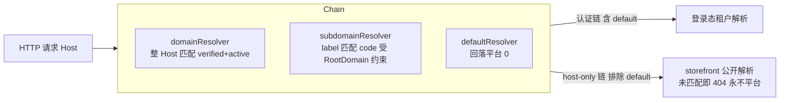

## Context

`linapro-tenant-core`以 resolver 链实现租户解析。经核实：

- `resolver.Service`接口已暴露`Register(resolver)`，链为`map[string]Resolver`，`New()`注册`override`、`jwt`、`session`、`header`、`subdomain`、`default`六个内置 resolver。
- `Config`已含`Chain`、`ReservedSubdomains`、`RootDomain`、`OnAmbiguous`字段；`Resolve(ctx, r, config)`按`config.Chain`顺序运行。
- `subdomainResolver`用`subdomainLabel(host, rootDomain)`取首段 label，再`findTenantByCode`按租户`code`匹配；`shared.DefaultRootDomain = ""`使其默认禁用。
- `defaultResolver`在无决策时回落`shared.PlatformTenantID`（0）。
- 租户表`plugin_linapro_tenant_core_tenant`仅含`code`/`name`/`status`，无域名字段。

缺口：自定义域名（CNAME）需按整个`request.Host`匹配，现有按`label == code`的子域名解析无法覆盖；且现链以`default`回落平台，不能直接用于顾客匿名解析。

## Goals / Non-Goals

**Goals：**

- 在`tenant-core`内新增自定义域名解析与可配置 subdomain 解析。
- 提供 host-only 解析路径，保证未匹配时不回落平台，供 storefront 消费。
- 提供平台作用域的域名映射管理与验证，并接入数据权限。

**Non-Goals：**

- 不接入`lina-core`storefront 公开请求路径（由`storefront-host-surface`承担）。
- 不实现完整 DNS CNAME 自动校验流程；P0 提供验证标记与令牌字段，自动校验留后续。
- 不开放跨插件外部 resolver 注册的宿主级 seam；P0 直接在`tenant-core`内注册`domainResolver`。
- 不新增 store 业务属性。

## Decisions

### D1 新增`domainResolver`按整域名匹配

新增`domainResolver`，以规范化后的`request.Host`查询域名表，命中`is_verified = true`且租户`status = active`时返回其`tenant_id`。注册进链并加入默认链顺序（置于`subdomain`之后、`default`之前）。备选是扩展`subdomainResolver`；否决原因：子域名按`label == code`语义，与整域名匹配语义不同，混用会破坏既有 login-stage 提示行为。

### D2 host-only 解析经`Config.Chain`实现，不回落平台

不新增独立解析方法，而是约定一个 host-only 链常量`Chain = [domain, subdomain]`（排除`default`）。storefront 以该`Config.Chain`调用现有`Resolve`；未匹配时`Resolve`返回空结果，调用方按 404 处理。`domainResolver`与`subdomainResolver`本身只返回命中租户或不匹配，永不返回平台`0`，红线由「排除`default`」保证。备选是新增`ResolveByHost`方法；否决原因：复用现有`Resolve` + `Config.Chain`更小、更契合既有设计。

### D3 开启 subdomain：配置驱动`RootDomain`

`resolverconfig`从插件`manifest/config/config.yaml`读取`RootDomain`与保留子域名，替代硬编码空值。`RootDomain`为空时 subdomain 解析保持禁用，保证默认安装行为不变。

### D4 域名管理为平台作用域并接入数据权限

域名映射（域名↔租户）是平台治理数据，管理 API 为平台作用域：列表/详情在查询阶段注入数据权限，创建/删除/验证在操作前校验目标租户与域名可见性。`host-only`解析作为公开解析例外，在 specs 明确权威边界与拒绝策略。

### 解析链与 host-only 路径

## Risks / Trade-offs

- 域名表与租户表分离查询 → 在`domain`表对`domain`建唯一索引、对`tenant_id`建索引，解析按单次等值查询完成，避免`N+1`与全表扫描。
- 未验证域名被解析导致越权 → `domainResolver`强制`is_verified = true`且租户`active`；未验证或停用域名一律不匹配。
- subdomain 误启用导致保留子域名被当作租户 → 保留`www`/`api`/`admin`/`static`/`docs`等拦截，`RootDomain`为空时整体禁用。
- 公开解析回落平台造成跨租户泄漏 → host-only 链排除`default`，并以单元测试断言未匹配时不返回平台`0`。

## Open Questions

- 域名自动校验（DNS CNAME/文件/邮件）的方式与归属，留后续迭代。
- storefront 调用 host-only 解析的具体接入形态（provider 方法或 capability 调用），在`storefront-host-surface`定夺。
